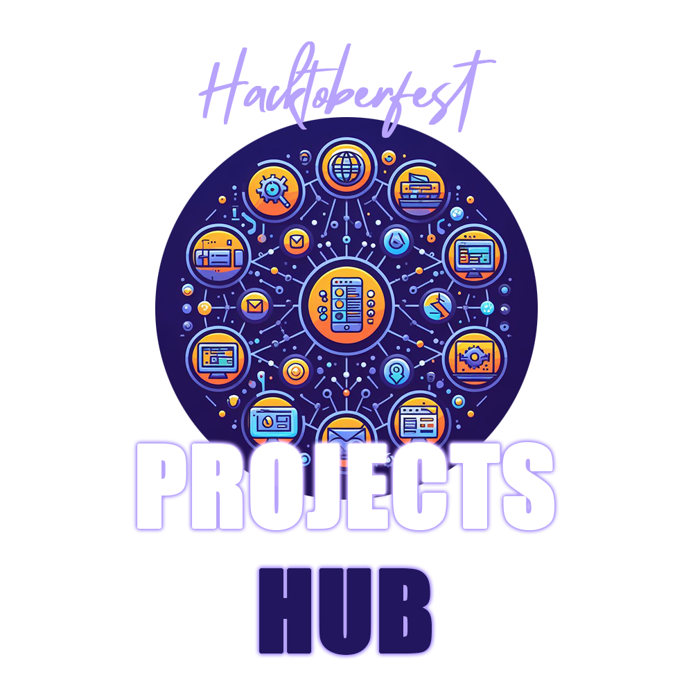

# Hacktoberfest Projects Hub

**Welcome to Hacktoberfest Projects Hub!** 🎉

Hacktoberfest Projects Hub is an open-source platform dedicated to curating and showcasing a diverse collection of projects participating in the annual Hacktoberfest event. Hacktoberfest is a global celebration of open source software where contributors from all around the world come together to support and contribute to open source projects.

## Table of Contents

- [Getting Started](#getting-started)
- [Key Features](#key-features)
- [Why Hacktoberfest Projects Hub?](#why-Hacktoberfest-Projects-Hub)
- [Contributing](#contributing)
- [Community](#community)
- [License](#license)

## Getting Started

To get started with Hacktoberfest Projects Hub, follow these simple steps:

1. [Browse Projects](#browse-projects): Discover Hacktoberfest-eligible projects that match your interests and skill level.
2. [Contribution Guidelines](#contribution-guidelines): Review the contribution guidelines for the selected project.
3. [Start Contributing](#start-contributing): Make meaningful contributions to open source projects.
4. [Track Your Progress](#track-your-progress): Keep an eye on your Hacktoberfest contributions and earn badges.

## Key Features

1. **Project Discovery:** Easily find Hacktoberfest-eligible projects by language, difficulty, or category.
2. **Contribution Guidelines:** Clear and concise guidelines for contributors.
3. **Beginner-Friendly:** Resources and tutorials for newcomers to open source.
4. **Project Promotion:** Showcase project information, screenshots, and documentation.
5. **Community Collaboration:** Connect with contributors and maintainers.
6. **Project Tracking:** Monitor your Hacktoberfest contributions and achievements.

## Why Hacktoberfest Projects Hub?

- **Simplifying Participation:** We aim to make Hacktoberfest participation accessible to everyone.
- **Promoting Diversity:** Highlighting projects from underrepresented communities.
- **Supporting Maintainers:** Empowering project maintainers to build vibrant open source communities.

## Contributing

We welcome contributions from developers of all backgrounds and experience levels. If you'd like to contribute to Hacktoberfest Projects Hub, please review our [Contribution Guidelines](CONTRIBUTING.md) for more information on how to get started.

## Community

Join our growing community and connect with developers from around the world:

- [Discord Chat Room]((https://discord.gg/YgUySdJC))

## License

This project is licensed under the [MIT License](LICENSE).

---

**Get Involved:** Hacktoberfest Projects Hub is an open-source project itself. You can contribute to its development, suggest new features, or report issues to help make it an even more valuable resource for the open source community. Happy Hacking! 🚀🌍🌟
